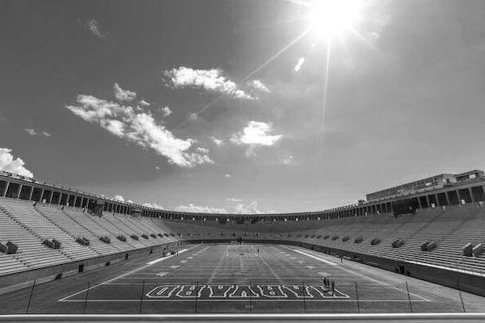
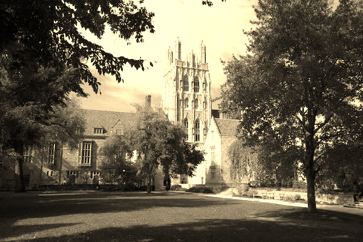
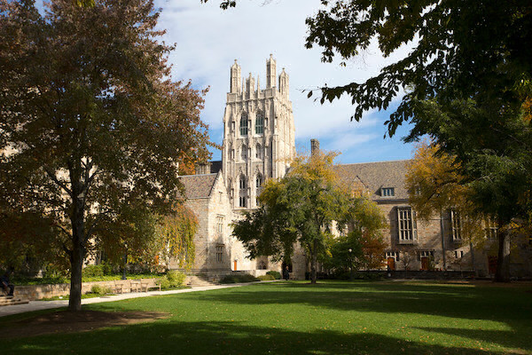

# Aplying-Filters-on-BMP
In this repository I have uploaded my project in c which applies different filters on BMP files.

This program is not OS specific and this program will also work in Linux or any other OS.

<h4>1. To use this program you first need to create an .exe and then run file also providing command-line arguments.
  Syntax:</h4>

./filter -filter pathofImage OutputImage

 
<h4>You can also run the below mentioned commands on your local but for Windows instead of 
./filter use just filter
</h4>
<h3>The Filters available are-> 
1 . Greyscale 
2 . Sepia 
3 . Edge-Detection 
4 . Blur 
5.  Reflected 
</h3>
 
<h4>Some bmp files and their output files are also provided in thsi repository in Output and Images folder</h4>

<h3>Here are some examples:</h3>

Command: ./filter -e images/yard.bmp Output/yard.bmp <h1>Original:<h1>

<h1>Edge-Detection</h1>
 

Command: ./filter -g images/stadium.bmp Output/stadium.bmp <h1>Original:<h1>

<h1>Grayscale</h1>
 

Command: ./filter -s images/courtyard.bmp Output/courtyard.bmp <h1>Original:<h1>

<h1>Sepia</h1>
  

Command: ./filter -b images/tower.bmp Output/tower.bmp <h1>Original:<h1>

<h1>Blur</h1>
 

Command: ./filter -r images/courtyard.bmp Output/courtyard2.bmp <h1>Original:<h1>

<h1>Reflected</h1>
  
